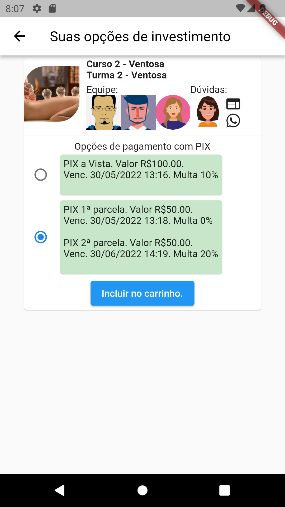

# aluno

A new Flutter project.

## create

 flutter create --project-name=aluno --org br.net.cemec --platforms android,web,linux -a kotlin ./aluno

 flutter create --project-name=numbersandcalc --org org.brintec --platforms android,web ./numbersandcalc

# deploy app web
cd ~/myapp/cemec.net.br/aluno && flutter build web && cd cloudcode/cemec-aluno && b4a deploy

# deploy cloudCode
cd ~/myapp/cemec.net.br/aluno/back4app/cemec-aluno && b4a deploy

# models
https://docs.google.com/spreadsheets/d/1riDT0bwi4o80OENwR3xbJnghHmr-isjSnELvydLdv1M/edit?usp=sharing

# telas
https://docs.google.com/drawings/d/1SGpkkld4pPfKd7qLtkdASiNuD9I9sU7NNubWBsjeI_s/edit

# Home

a|b
---|---
|
|
|
|
|