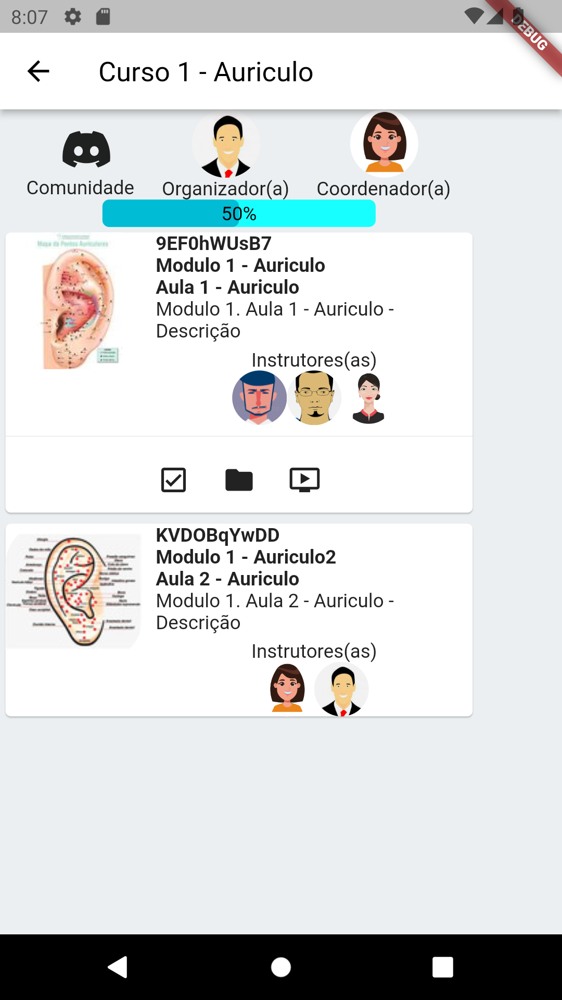

# aluno

A new Flutter project.

## create

 flutter create --project-name=aluno --org br.net.cemec --platforms android,web,linux -a kotlin ./aluno

# deploy app web

cd ~/myapp/cemec.net.br/aluno && flutter build web && cd cloudcode/cemec-aluno && b4a deploy

# deploy cloudCode
cd ~/myapp/cemec.net.br/aluno/back4app/cemec-aluno && b4a deploy

# models
https://docs.google.com/spreadsheets/d/1riDT0bwi4o80OENwR3xbJnghHmr-isjSnELvydLdv1M/edit?usp=sharing

# CoursePaid
name | type | objeto1 | example2
---|---|---|---
userId | Pointer | a |
courseId | Pointer | b|
contentIfPaid | [Pointer] | [c,d]|
contentCompleted | [Pointer] | [e,f]|
totalCost| String | 100.00|
parcel | int | 1 |
parcelTotal | int | 1 |
typePayment | pix | pix | 

1. user
2. CourseId-Pointer
3. aulasPaids-ListPointer
4. aulaConcluidas-ListPointer
5. valorTotal
6. parcela
7. parcelas
8. pix/boleto/cartao
9. descricao
10. valor
11. aulasPaids-ListPointer
12. StatusPagamento

# courseModPaid
1. CourseId-Pointer
2. valorTotal
3. parcela
4. parcelas
5. pix/boleto/cartao
6. descricao
7. valor
8. aulasPaids-ListPointer

# courseSale
1. CourseId-Pointer
2. inscrições

# CourseId
1. Nome o curso
2. Turma
3. icone
4. comunidade
4. site
6. org-Obj
   1. UserId
   2. nome
   3. photo
   4. contato
7. coord-Obj
   1. userId
   2. nome
   3. photo
8. prof-ListObj
   1. UserId
   2. nome
   3. photo
9. AulaId-ListPointer

# AulaId
1. CourseId-ListPointer
2. nome do modulo
3. nome da aula
4. descricao da aula
5. profList
   1. nome
   2. photo
6. url folder
7. url video

# Home

a|b
---|---
|
|
|
|
|